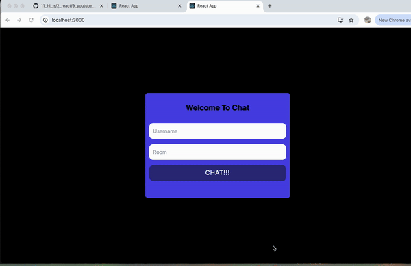

# Real-Time Chat Application

A real-time chat application built with React and Node.js, using Socket.io for instant messaging. Users can join specific rooms and communicate with others in real time, with messages displayed based on sender alignment.

# Features

Real-time messaging with Socket.io
Room-based chat functionality
Responsive design for a seamless experience

# Preview

